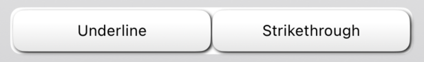
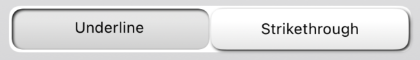
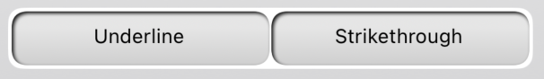

# MultiSegmentedControl
A segmented control supporting multiple selection

In order to use this Control, pass in an array of **Binding\<Control>** to the initializer of _MultiSegmentedControl(controls: [Binding\<Control>])_.

Those would be the **@State** variables in the calling View.

``` swift
@State private var controlOne: Control = Control(name: "1st control")
@State private var controlTwo: Control = Control(name: "2nd control")
*
*
```
and then...

``` swift
MultiSegmentedControl(controls: [$controlOne, $controlTwo])
```

Toggling control elements will toggle _isActive_ property of the **Control**, which you can then use to accomplish View updates.
 
### Both Not Selected

### One Selected

### Both Selected


Optionaly, you can adjust the grayscale color of the Elements, by adjusting _grayscaleWhiteAmount_, through _init()_. Default is **0.8**.

``` swift
MultiSegmentedControl(controls: [Binding<Control>], grayscaleWhiteAmount: CGFloat)
```
